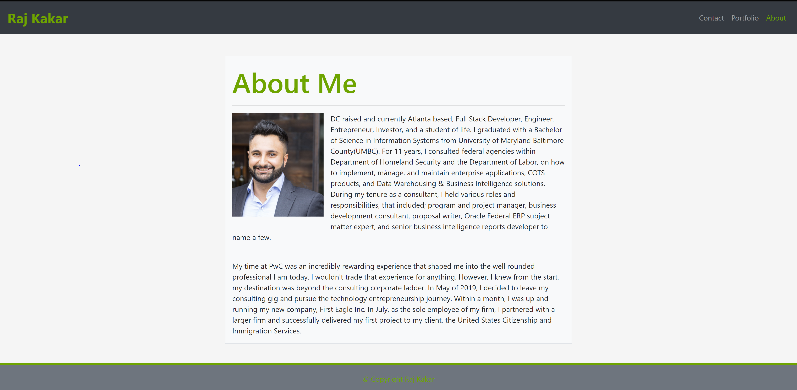

# Raj-Kakar-Portfolio

## Description

The purpose of this website is to be able to provide a background of my qualifications, skill sets, experiences, interests, and how someone can reach me. Additionally, the portfolio website also allows me to display my projects to potential employers or founders.

Below are links to the webpage and the github repository for my portfolio website:

Github Pages URL: <https://rajdeep24.github.io/My-Portfolio/>

Github Repository: <https://github.com/rajdeep24/My-Portfolio>

## Table of Contents (Optional)

- [Installation](#installation)
- [Usage](#usage)
- [Credits](#credits)
- [License](#license)

## Installation

No installation required. Simply view the application by clicking on the following link:

<https://rajdeep24.github.io/Raj-Kakar-Portfolio/>

## Usage

Bellow is a screenshot of my portfolio website.

## Credits

I would like to credit my peers, instructors, and teacher assistants from the GT bootcamp. They were an integral part in providing the essential knowledge and guidance needed to accomplish this task.

## License

Feel free to leverage the code to learn more about building a responsive mobile first portfolio website by leveraging bootstrap.

---

## Badges

